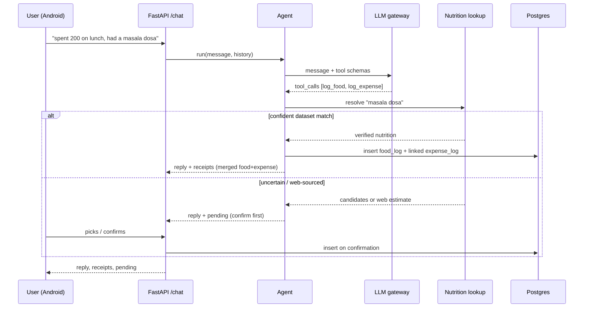
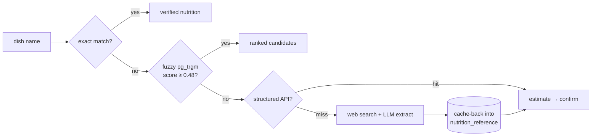

# NutriSpend

**A voice-first, conversational tracker for money *and* meals — built for Indian food.**

Tell it what you spent or ate in plain language — *"spent 200 on lunch, had two
masala dosas"* — and NutriSpend logs the expense **and** the nutrition (calories,
protein, carbs, fats, sugar) in one turn. It figures out the dish, estimates the
portion, and only asks you when it's genuinely unsure.

This repository is the **backend API**. A native **Android** app (Kotlin /
Jetpack Compose) is the primary client.

---

## Why it exists

Most trackers make you fill forms. NutriSpend is a chat: one message, both
ledgers updated. The hard part isn't the chat — it's turning *"paneer sabzi"*
into a trustworthy calorie number for Indian dishes that no clean dataset fully
covers. NutriSpend does that with a layered nutrition lookup that falls back to
the web only when it must, and it never passes a guess off as a fact.

## Features

- **One-message logging** — expense + food in a single natural-language turn.
- **Indian-food nutrition** — seeded from a 1,000+ dish dataset, extended live.
- **Trustworthy estimates** — web-sourced values are flagged (`EST.`) and always
  confirmed with you before logging; verified dataset matches log silently.
- **Human-in-the-loop** — ambiguous dishes return pickable candidates, not a
  wrong guess.
- **Per-user goals** — daily budget + calorie/macro targets, editable, server-stored.
- **Insights** — today/week summaries, spend-by-hour, and a merged day-by-day history.
- **Self-improving cache** — a food you confirm once is remembered as verified.

---

## Architecture

A single reusable **agent** routes every message to typed **tools**; a layered
**nutrition lookup** resolves dishes; thin **services** own the business rules and
sit behind **repository interfaces** (so the whole thing tests without a DB or a
network).

### Stack

| Layer | Choice |
|---|---|
| API | FastAPI |
| ORM / migrations | SQLAlchemy 2.0 + Alembic |
| Database | Supabase Postgres (via the transaction pooler) + `pg_trgm` |
| LLM | OpenAI SDK → OpenAI-compatible gateway serving a Claude model |
| Web fallback | DuckDuckGo (`ddgs`) + LLM extraction |
| Auth | Custom JWT (PyJWT) + bcrypt |
| Config | pydantic-settings |
| Tests | pytest (fully offline, 24 tests, ~1s) |

### The chat turn (agent + tools)



### Nutrition lookup — Chain of Responsibility

Each link answers if it can, otherwise delegates. Character-based fuzzy matching
is *not* semantic, so a weak match falls through to a real web estimate rather
than surfacing a confidently-wrong dish.



Web/API values are marked unverified and always require confirmation; confirming
one **promotes** it to a verified source, so the second time it's instant.

---

## Directory overview

```
app/
├── main.py                 FastAPI app + request/DB/LLM observability middleware
├── api/                    HTTP layer (thin; delegates to services)
│   ├── auth.py             /auth/signup, /auth/login → JWT
│   ├── users.py            /me, PATCH /me (api key), PATCH /me/goals
│   ├── chat.py             POST /chat → runs the agent
│   ├── tracking.py         expenses, food, summaries, hourly, history, lookup
│   ├── deps.py             DI wiring; per-request txn boundary; current user
│   └── schemas.py          pydantic request/response models
├── agent/                  agent.py (tool loop) · tools.py · prompt.py
├── llm/                    LLMClient interface + OpenAI-compatible adapter
├── nutrition/              lookup (CoR) · portions · scaling · text-normalize
├── adapters/              web_search (ddgs) · web/API nutrition sources
├── services/               auth · food · expense · nutrition (business rules)
├── repos/                  interfaces + SQLAlchemy implementations
├── db/                     models · session · health · seed_nutrition
└── core/                   config · security · dates (IST) · observability
migrations/                 Alembic (0001 schema+pg_trgm, 0002 is_estimate, 0003 goals)
tests/                      offline fakes (in-memory repos, scripted LLM)
```

## API reference

All routes require `Authorization: Bearer <jwt>` except `/health`, `/auth/*`.

| Method | Path | Purpose |
|---|---|---|
| `GET` | `/health` | Liveness + DB ping |
| `POST` | `/auth/signup` · `/auth/login` | Register / log in → token |
| `GET` | `/me` | Profile + daily goals |
| `PATCH` | `/me` | Set personal LLM API key |
| `PATCH` | `/me/goals` | Update daily goals (partial) |
| `POST` | `/chat` | Conversational logging (the agent) |
| `POST` / `GET` | `/expenses` | Log / list expenses |
| `POST` / `GET` | `/food` | Log / list food |
| `GET` | `/summary` | Spend or calories for today/week |
| `GET` | `/summary/hourly` | Spend bucketed by hour of day |
| `GET` | `/history` | Merged day-by-day expenses + food |
| `GET` | `/nutrition/lookup` | Look up a dish without logging |

Interactive docs at `/docs` when running.

---

## Getting started

**Requirements:** Python 3.12, a Postgres database (Supabase works out of the
box), and access to an OpenAI-compatible LLM endpoint.

```bash
# 1. Install
pip install -r requirements.txt

# 2. Configure — copy and fill in your values
cp .env.example .env
#   DATABASE_URL, LLM_API_KEY, LLM_BASE_URL, LLM_MODEL, JWT_SECRET

# 3. Migrate + seed nutrition data
alembic upgrade head
python -m app.db.seed_nutrition        # loads the Indian-food dataset

# 4. Run
uvicorn app.main:app --reload --host 0.0.0.0 --port 8055
```

> Run modules with `python -m ...` (not `python app/...`) so the project root is
> on `sys.path`.

### Configuration

| Variable | Description |
|---|---|
| `DATABASE_URL` | Postgres URL, `postgresql+psycopg://…` (Supabase pooler, port 6543) |
| `LLM_API_KEY` | Key for the LLM gateway |
| `LLM_BASE_URL` | OpenAI-compatible base URL |
| `LLM_MODEL` | Model id served by the gateway |
| `JWT_SECRET` | Strong random secret — `python -c "import secrets; print(secrets.token_urlsafe(48))"` |

## Testing

```bash
pytest
```

The suite is fully offline — in-memory repositories, a scripted LLM, and a fake
web search — so it needs no database or gateway.

## Deployment

Ships to **Render** as a native Python service (`render.yaml` blueprint). Start
command runs migrations then boots uvicorn. See **[DEPLOY.md](DEPLOY.md)** for the
full backend + Android release checklist.

## Design notes

- **No dynamic discovery** — sites/tasks/tools are explicit registrations, so
  behaviour is inspectable and testable.
- **Services never commit** — the request dependency owns the transaction, which
  keeps business logic pure and tests trivial.
- **`.env` is authoritative over ambient env** — a stray `ANTHROPIC_*` in the
  shell can't hijack config.
- **Historical logs are snapshots** — a food entry stores its computed nutrients,
  so later corrections to a reference never rewrite the past.
- **Timezone** — day boundaries and hourly buckets use IST (India-facing).

## Roadmap

- Voice replies (TTS) — input already works via on-device speech
- Remote MCP server so other agents can log on your behalf
- Multi-timezone support (IST is currently hardcoded)
